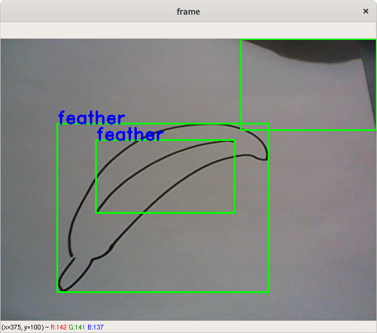
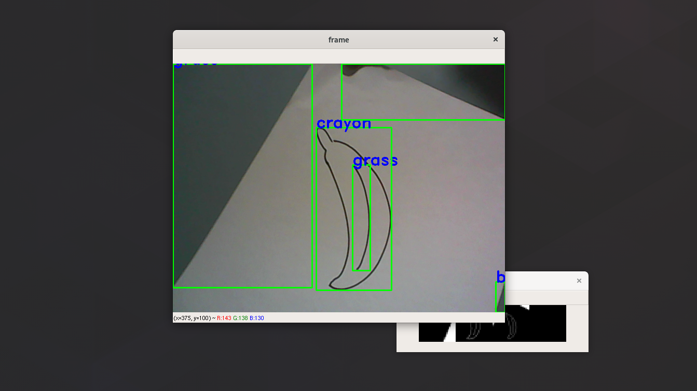

# quickdraw_camera
Sketch detection with OpenCV, Keras and QuickDraw! dataset

## [QuickDraw!](https://github.com/googlecreativelab/quickdraw-dataset) dataset
Get the npy files over [here](https://console.cloud.google.com/storage/browser/quickdraw_dataset/full/numpy_bitmap)!

## CNN model
Convolutional Neural Network model was taken from:
[https://github.com/kradolfer/quickdraw-image-recognition](https://github.com/kradolfer/quickdraw-image-recognition)

## Screenshots

